# Next.js 国际化 (i18n)：通过 next-intl 走向国际

虽然英语被认为是网络上的通用语言，但当您按[母语人士数量查看排名靠前的语言](https://www.babbel.com/en/magazine/the-10-most-spoken-languages-in-the-world)时，结果看起来相当多样化：

- 中文（13亿）
- 西班牙语（4.86亿）
- 英语（3.8亿）
- 阿拉伯语（3.62亿）
- 印地语（3.44亿）

语言是沟通的基础，很明显，如果你希望向国际友人提供你的 `Web` 内容，你可以通过支持多种语言来增强用户体验。国际化（通常缩写为i18n）还可以让您的企业在全球范围内扩张并进入新市场。

在本文中，我们将通过使用[next-intl](https://next-intl-docs.vercel.app/)实现国际化，这是一个专门为 `Next.js` 创建的库，它提供了国际化 Web 体验的所有相关部分。


# 目录

- [1. 首先查看应用程序](#1-首先查看应用程序)
- [2. 多语言或多区域](#2-多语言或多区域)
- [3. 规划 URL 结构](#3-规划-url-结构)
  - [3.1 基于域名的国际化](#31-基于域名的国际化)
  - [3.2 基于URL路径的国际化](#32-基于url路径的国际化)
- [4. 设置next-intl](#4-设置next-intl)
- [5. 提取硬编码标签](#5-提取硬编码标签)
- [6. 国际化后端数据](#6-国际化后端数据)
- [7. 格式化货币](#7-格式化货币)
- [8. 格式化日期](#8-格式化日期)
- [9. 国际化路径](#9-国际化路径)
- [10. 创建语言环境切换器](#10-创建语言环境切换器)
- [11. 如何确保静态渲染？](#11-如何确保静态渲染)
- [12. 国际化管理平台Crowdin](#12-国际化管理平台crowdin)
  - [12.1 创建项目](#121-创建项目)
  - [12.2 安装CLI](#122-安装cli)
  - [12.3 初始化配置文件](#123-初始化配置文件)
  - [12.4 上传源文件](#124-上传源文件)
  - [12.5 下载翻译文件](#125-下载翻译文件)
  - [12.6 GitHub工作流集成](#126-github工作流集成)
- [13. Nextjs常用的东西记录](#13-Nextjs常用的东西记录)
  - [13.1 获取当前URL路径名](#131-获取当前url路径名)
  - [13.2 编程式导航](#132-编程式导航)
  - [13.3 获取当前 URL 的查询字符串](#133-获取当前-url-的查询字符串)

## 1. 首先查看应用程序

我们使用 `Next.js` 的 `App Router`实现了`主页`和`产品详情页面`;本文假定你已经具备[Next.js App Router](https://nextjs.org/docs/app)的基本知识。

让我们看一下当前的应用程序，以确定我们在国际化过程中需要解决的所有问题。

`主页`：此页面顶部有一个大的`Banner`部分，下面是产品推荐列表。


`产品详情页面`：此页面提供特定自行车的详细信息。
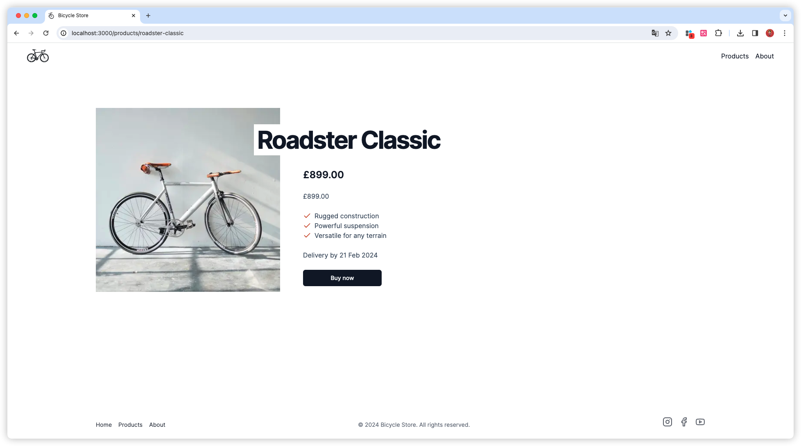


## 2. 多语言或多区域

在构建国际化体验时，我们通常会考虑两种规范：

- **多语言**：网站提供多种语言的内容。
- **多区域**：网站明确针对不同国家的用户。

在浏览了现有的网页之后，我们可以确定需要国际化的部份：

- **标签**：目前，所有文字都是硬编码，我们需要将它们替换为根据当前语言而变化的动态标签。
- **后端数据**：数据库中的产品信息需要提供国际化。
- **货币**：货币币种的国际化。
- **格式设置**：数字、日期和时间格式设置应考虑用户的语言和区域。
- **国家/地区选择器**：虽然我们可以根据请求标头猜测用户的国家/地区和语言，但我们应该允许用户明确选择语种。

## 3. 规划 URL 结构

我们使用术语`locale`来描述语言。

例子：
- en：英语
- zh：中文

### 3.1 基于域名的国际化

基于域名的国际化是根据顶级域名或者次顶级域名实现：

```
# 美国
example.us

# 中国
example.cn
```

### 3.2 基于URL路径的国际化

基于URL路径的国际化是将区域移动到URL上：

```
# 美国
example.com/en

# 中国
example.com/zh
```

两者的区别：
  1. 结构差异：
  **基于域名国际化**依赖于使用不同的顶级域名（如.com、.en、.zh）或次级域名（如us.example.com、fr.example.com）来针对不同的国家或语言提供内容。
  **基于URL路径的国际化**则在同一个域名下使用不同的路径来区分内容（如www.example.com/en/、www.example.com/fr/）。
  2. SEO影响：
  **基于域名国际化**可能对本地化SEO更有利，因为搜索引擎中的地理定位信号更明确。
  **基于URL路径的国际化**，在SEO方面可能需要更多的设置(例如：配置hreflang标签)来向搜索引擎表明每个路径的地区相关性。
  3. 用户体验：
  **基于域名国际化**可以提供更本地化的体验，顶级域名有助于用户识别适合自己所在地区的网站版本。
  **基于URL路径的国际化**可能需要额外的导航或选择机制来允许用户手动选择他们的语言或地区偏好。
  4. 资源和维护：
  **基于域名国际化**管理起来可能更复杂，因为你需要为每个国家/地区版本单独购买和维护多个域名。
  **基于URL路径的国际化**相对容易管理，因为所有内容都在一个域名下，共享服务器和资源。
  5. 成本：
  **基于域名国际化**通常成本更高，因为需要注册并维护多个域名。
  **基于URL路径的国际化**在成本上通常更低廉，因为只需要维护一个域名。
  6. 法律和隐私合规：
  **基于域名国际化**可能更容易满足不同国家法律和隐私的要求。
  **基于URL路径的国际化**要确保单一网站符合所有不同国家的法律和隐私标准可能更有挑战。

## 4. 设置next-intl

对于本文中的示例商店，我们将采用上面的[3.2 基于URL路径的国际化](#32-基于url路径的国际化)。

[next-intl](https://next-intl-docs.vercel.app/)默认情况下使用基于URL路径的国际化（例如/en）。

next-intl 将提供以下组件，以实现应用程序的国际化：
  - [Next.js](https://nextjs.org/docs/app/building-your-application/routing/internationalization) 的国际化路由
  - 特定于区域设置的文本标签，称为`messages`
  - 特定于区域设置的日期、时间和数字格式

不过，首先让我们来看看该程序的初始结构：
```
└── src
    └── app
        ├── layout.tsx
        ├── page.tsx
        └── products
            └── [sku]
                └── page.tsx
```

按照 [next-intl的入门指南](https://next-intl-docs.vercel.app/docs/getting-started/app-router) 进行操作后，我们的文件将被这样整理：
```
├── src
│   ├── app
│   │   └── [locale]
│   │       ├── layout.tsx
│   │       ├── page.tsx
│   │       └── products
│   │           └── [sku]
│   │               └── page.tsx
│   ├── i18n.ts
│   └── middleware.ts
└── messages
    └── en.json
```

观测发现最明显的区别是，所有`layout`和`page`模块都被移到了 [locale] 文件夹中。这个动态路由将帮助我们使文件夹内的所有页面都具有本地化意识。

此外，还添加了以下文件：
  - **messages/en.json**：该文件将包含所有 en 语言的标签。
  - **i18n.ts**：此模块用于向 React 服务器组件提供 i18n 配置，如特定于本地的消息。
  - **middleware.ts**：next-intl 中间件将为 / 引入重定向，转发到最匹配的本地语种（例如 /en），并设置 cookie 以记住用户偏好。


## 5. 提取硬编码标签

使用 `react/jsx-no-literals` 规则配合我们找到所有的硬编码标签，然后再安装一个[vscode插件 i18n Ally](https://marketplace.visualstudio.com/items?itemName=lokalise.i18n-ally) 使我们能够更愉快的国际化开发。

`react/jsx-no-literals` 规则使硬编码一目了然：
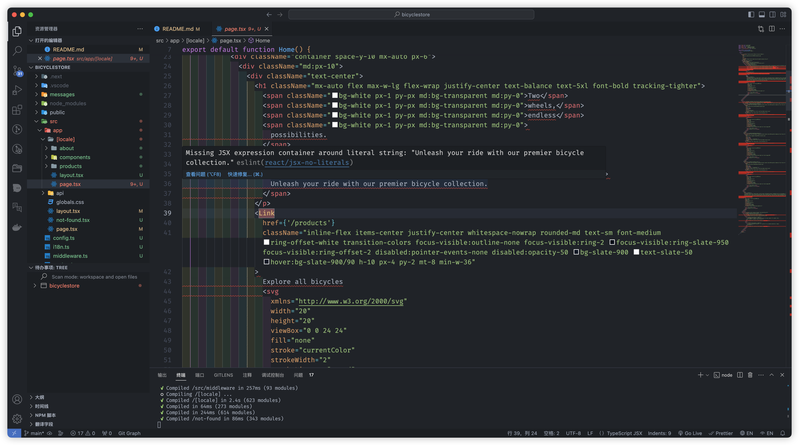

`i18n Ally` 可以在直接预览国际化内容：
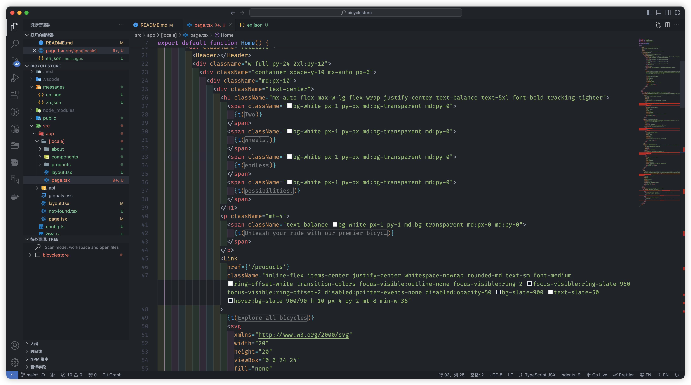

## 6. 国际化后端数据

一旦我们在主页上提取了静态标签，我们就会考虑将区域设置和国家/地区合并到使用后端数据的组件中。

首先，特色产品应适配为使用用户所在国家返回当地货币价格：


其次，推荐应考虑用户的语言：


为了将语种转发到后端，所有端点现在都将接受一个`locale`参数：
```
GET /api/testimonials?locale=en
GET /api/product?locale=en
GET /api/product/[sku]?locale=en
```
如果是在` next api `路由中，你可以将api路由包裹到国际化路由下，然后在params中获取语种：

```
import { NextRequest, NextResponse } from 'next/server'

export async function GET(request: NextRequest, { params }: { params: { locale: string } }) {
  console.log('🚀 ~  : GET -> params', params.locale)
  console.log('🚀 ~  : GET -> request', request)
  return NextResponse.json({ data: 'test' })
}

```

## 7. 格式化货币

`useFormatter` 钩子：
```
  const format = useFormatter();
  // 如果是异步组件 const format = await getFormatter()

  {format.number(i.price.value, {
    style: 'currency',
    currency: i.price.currency
  })}
```

## 8. 格式化日期
```
const format = useFormatter();
// 如果是异步组件 const format = await getFormatter()

return (
  // ...

  <p>{format.dateTime(product.deliveryDate, {dateStyle: 'medium'})}</p>
);
```

## 9. 国际化路径

如果需要国际化路径, `next-intl`也能够帮助我们实现：
```
/src/navigation.ts
import {createLocalizedPathnamesNavigation} from 'next-intl/navigation';
import {Pathnames} from 'next-intl/navigation';

export const locales = ['en', 'zh'] as const

export const pathnames = {
  '/': '/',
  '/products': {
    en: '/products',
    zh: '/products-zh' // 实际上中文不需要国际化路径，这里就是告诉下有这个功能
  },
  '/products/[sku]': {
    en: '/products/[sku]',
    zh: '/products-zh/[sku]'
  },
  '/about': {
    en: '/about',
    zh: '/about-zh'
  }
} satisfies Pathnames<typeof locales>

export const {Link, redirect, usePathname, useRouter} =
  createLocalizedPathnamesNavigation({locales, pathnames});
```
接着修改 `middleware` 文件:
```
import createMiddleware from 'next-intl/middleware';
import {locales, pathnames} from './navigation';

export default createMiddleware({
  defaultLocale: 'en',
  locales,
  pathnames
});
```
鼠标hover,国际化路径生效了：


但是现在`<Link>` 标签报错, 因为使用动态路由，所以跳转的时候需要动态传递:
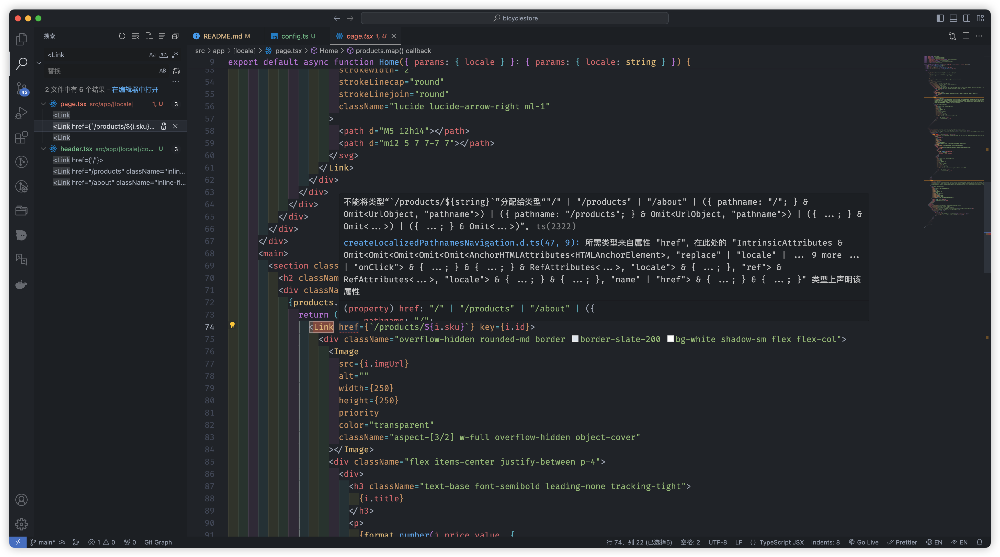

```
<Link href={{pathname: '/products/[sku]', params: {sku: product.sku}}}>
</Link>
```

## 10. 创建语言环境切换器

```
import {useLocale, useTranslations} from 'next-intl';
import LocaleSwitcherSelect from './LocaleSwitcherSelect';
import LocaleIcon from './LocaleIcon';

export default function LocaleSwitcher() {
  const t = useTranslations('LocaleSwitcher');
  const locale = useLocale();

  return (
    <label>
      <p className="sr-only">{t('label')}</p>
      <LocaleIcon locale={locale} />
      <LocaleSwitcherSelect defaultValue={locale}>
        <option value="en-gb">{t('en-gb')}</option>
        <option value="de-ch">{t('de-ch')}</option>
      </LocaleSwitcherSelect>
    </label>
  );
}
```

```
'use client';

import {usePathname, useRouter} from '@/navigation';
import {useParams} from 'next/navigation';

export default function LocaleSwitcherSelect(props: React.ComponentProps<'select'>) {
  const router = useRouter();
  const params = useParams();
  const pathname = usePathname();

  function onChange(event: React.ChangeEvent<HTMLSelectElement>) {
    const locale = event.target.value;
    router.push(
      {
        pathname,
        params: params as any
      },
      {locale}
    );
  }

  return <select {...props} onChange={onChange} />;
}
```

## 11. 如何确保静态渲染？

Next.js 自动管理每个组件的渲染策略，在可以的情况下默认为静态渲染。如果它在组件中看到动态函数，例如获取请求，它会自动将其策略切换为动态渲染。

静态渲染对性能有好处，因为它允许缓存整个组件，因此我们希望尽可能地利用它。

然而，next-intl 默认情况下会将我们所有的组件变成动态的。npm run build当我们运行创建应用程序的生产版本时，这一点很清楚：

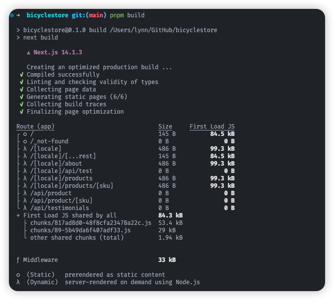

幸运的是，next-intl 确实提供了一种恢复静态渲染的解决方法。让我们看一下。首先，我们需要告诉 Next.js [locale] 路由参数的所有可能值，以便它可以在静态构建期间解析该参数。我们通过generateStaticParams()来做到这一点。

about 页面是完全可以静态渲染的，所以我们来改造下：
```
// app/[locale]/about/layout.tsx
import { locales } from '@/config'

export function generateStaticParams() {
  return locales.map(locale => ({ locale }))
}

export default function RootLayout({
  children,
  params: { locale }
}: Readonly<{
  children: React.ReactNode
  params: { locale: string }
}>) {
  return <div>{children}</div>
}
```
这会处理参数[locale]。但是，如果我们现在运行pnpm run build，next-intl 会抛出一个错误，告诉我们它只允许动态渲染。

作为权宜之计，该库为我们提供了一个添加到静态组件中的函数：unstable_setRequestLocale(locale)。此函数获取locale每个呈现页面的路由参数，并确保页面可以在构建时静态呈现。让我们在我们的布局和几个页面中使用它。

```
// app/[locale]/about/layout.tsx

import { locales } from '@/config'
import { unstable_setRequestLocale } from 'next-intl/server'

export function generateStaticParams() {
  return locales.map(locale => ({ locale }))
}

export default function RootLayout({
  children,
  params: { locale }
}: Readonly<{
  children: React.ReactNode
  params: { locale: string }
}>) {
  // Ensures static rendering at build time.
  unstable_setRequestLocale(locale)

  return <div>{children}</div>
}

```

✋ 注意 » Next.js 可以分别渲染布局和页面，因此最好在我们的布局和页面中包含unstable_setRequestLocale()。
```
// app/[locale]/about/page.tsx

import { useTranslations } from 'next-intl'
import Footer from '../components/footer'
import Header from '../components/header'
import { unstable_setRequestLocale } from 'next-intl/server'

const About = ({ params }: { params: { locale: string } }) => {
  // Ensures static rendering at build time.
  unstable_setRequestLocale(params.locale)

  const t = useTranslations('About')

  return (
    <>
      <Header></Header>
      <div className="container py-24 mx-auto px-6">
        <h1 className="text-3xl font-bold">{t('msg')}</h1>
      </div>
      <Footer></Footer>
    </>
  )
}

export default About


```

build 后发现 about 页面已经被静态化了。 👏
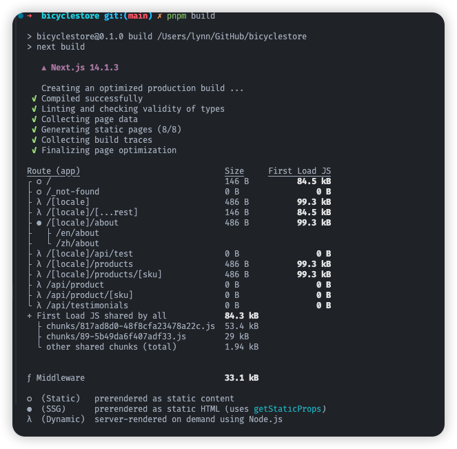

✋ 注意 » 具有 next-intl 的服务器组件是静态生成的，但不是静态导出的；只有客户端组件支持使用 next-intl 进行静态导出。

💡 了解更多 » unstable_setRequestLocale()表示临时的 next-intl 解决方案，它将被 React 即将推出的createServerContext. 更多信息请参见[next-intl](https://next-intl-docs.vercel.app/docs/getting-started/app-router#static-rendering) 的文档。


## 12. 国际化管理平台Crowdin

next-intl 可与所有支持翻译 JSON 文件的本地化管理平台配合使用，但 next-intl 推荐使用 Crowdin 来管理翻译。

那就来试试官方推荐的平台 [Crowdin](https://crowdin.github.io/crowdin-cli/)。

### 12.1 创建项目

登陆注册拿到14天试用账号，进入个人中心创建项目：
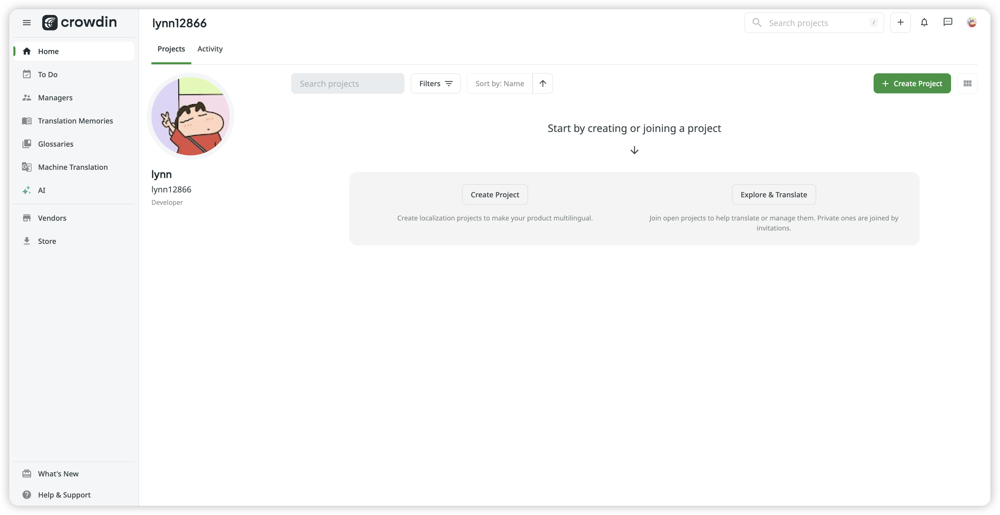

选择需要翻译的语种,这里选择翻译成简体中文。
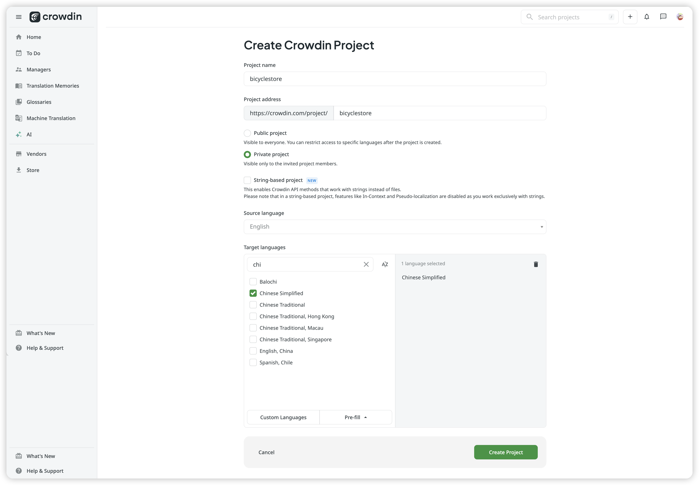

项目创建好后拿到这个项目ID，CLI步骤中要用到：
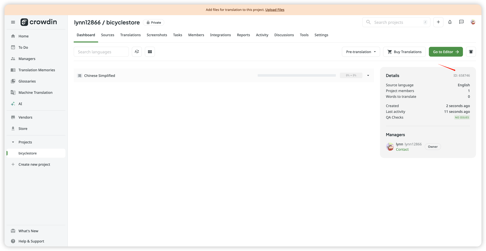

### 12.2 安装CLI

安装[CLI](https://crowdin.github.io/crowdin-cli/):
```
pnpm add @crowdin/cli -D
```

### 12.3 初始化配置文件

```
npx crowdin init
```
执行命令授权登陆后输入上面创建项目拿到的项目ID,CLI会帮创建一个YML文件，我们需要修改的地方在这里：

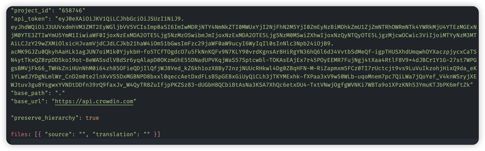

这里修改成：
```
files:
  [
    {
      "source": "/messages/en.json",
      "translation": "/messages/%two_letters_code%.json",
    },
  ]
```

`%two_letters_code%` 是个[占位符](https://developer.crowdin.com/configuration-file/#placeholders)

### 12.4 上传源文件

将源文件上传到 Crowdin 平台：
```
npx crowdin upload 
```

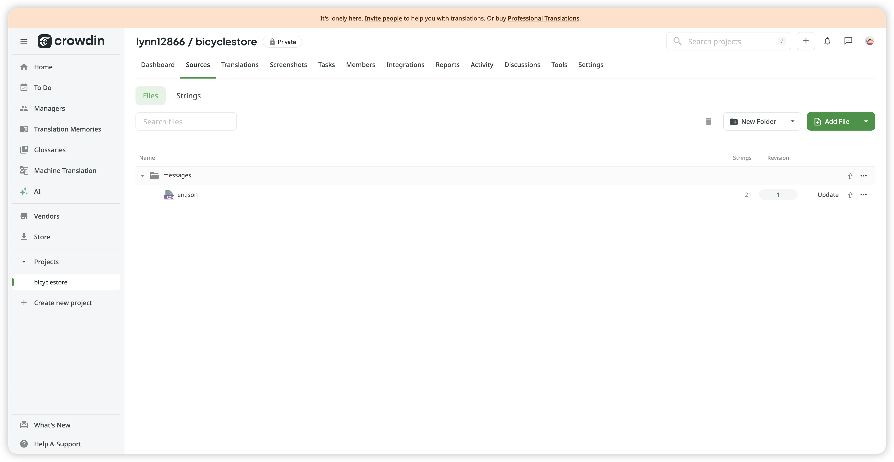

### 12.5 下载翻译文件

源文件上传后 Crowdin 预翻译出来：

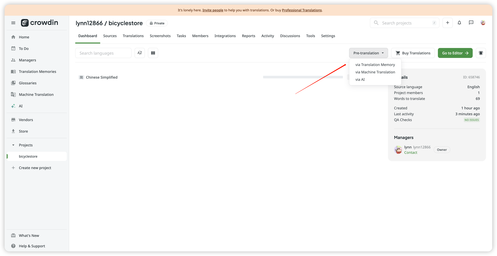

执行命令拉取翻译后的文件：
```
npx crowdin pull
```

整体流程就是这样，这种方式需要我们利用CLI每次pull最新的翻译文件进行部署。
所以我们可以集成Github工作流。

### 12.6 GitHub工作流集成

进入项目`集成`界面：
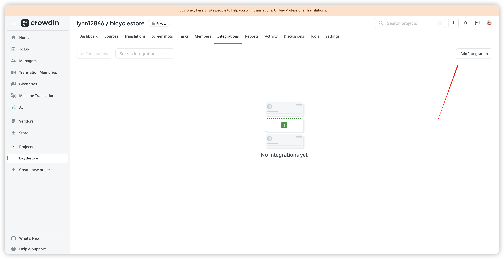

安装GitHub插件:
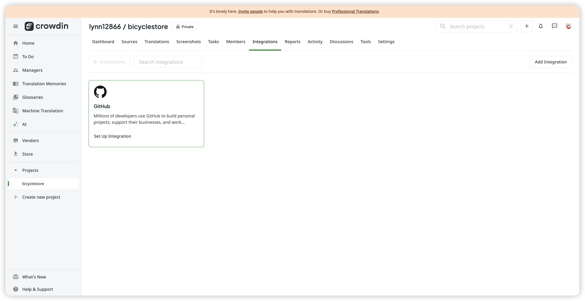

点击插件进行登陆授权后选择关联项目：
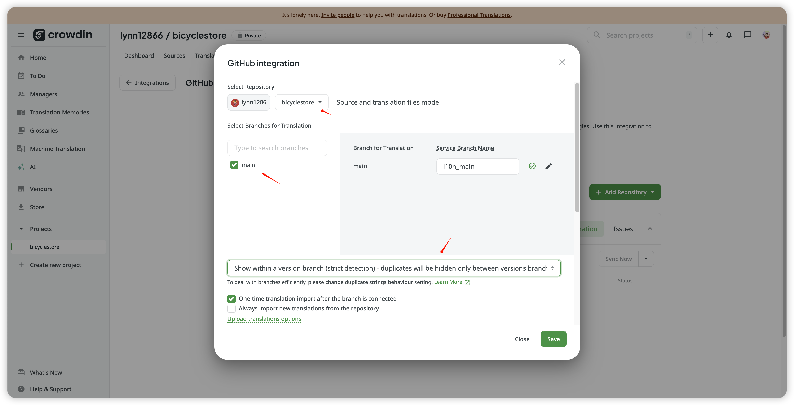

> 注意⚠️： 试用用户只能创建[关联一个分支](https://community.crowdin.com/t/this-action-is-not-available-for-account-subscription-plan/3282)。Crowdin 支持开源开发者，所以想要获取免费用户，需要提交开源项目申请，否则只能当个付费用户了。

回到正题，看到github仓库已经被关联：
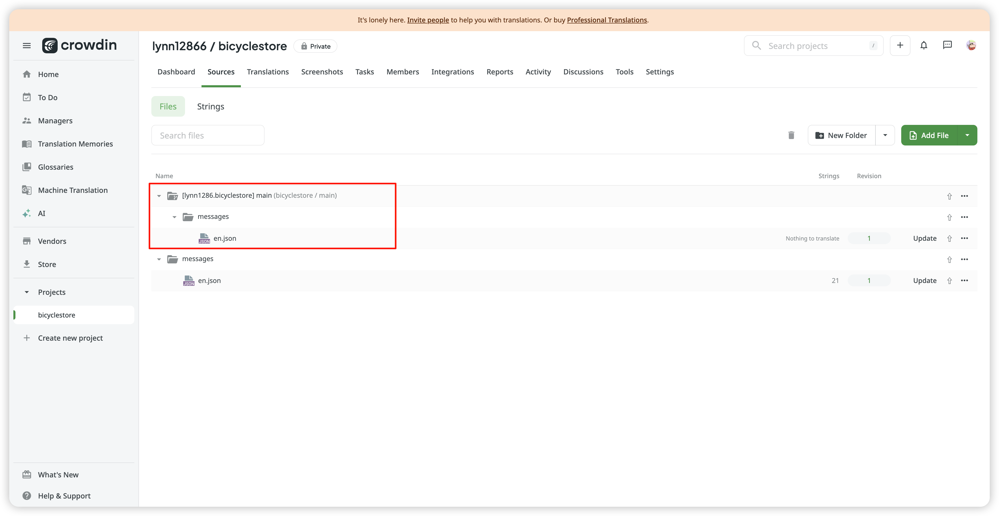

进行关联后假设你是翻译人员，对文本进行翻译后，gihub会出现变动：
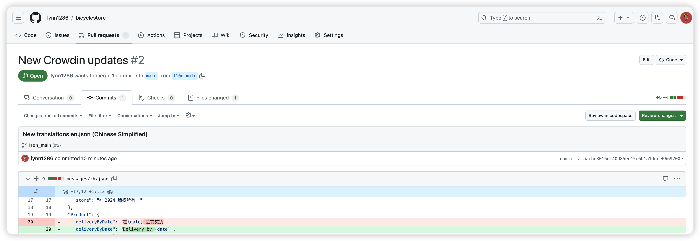


顺带说一句：
- [CLI文档看这里](https://crowdin.github.io/crowdin-cli/)
- [工作流文档看这里](https://support.crowdin.com/enterprise/overview/)
- [CLI占位符和Github其他配置文档看这里](https://developer.crowdin.com/configuration-file/#placeholders)


## 13. Nextjs常用的东西记录

### 13.1 获取当前URL路径名
```
  'use client'
  import { usePathname } from 'next/navigation'
  // next-intl 中使用内部暴露的
  // import { usePathname } from '@/navigation'

  const pathname = usePathname()
```

服务端获取当前URL路径名需要借助[中间件实现](https://stackoverflow.com/questions/74584091/how-to-get-the-current-pathname-in-the-app-directory-of-next-js),因为使用了`header`所以组件会变成动态渲染。


### 13.2 编程式导航
```
  'use client'
  import { useRouter } from 'next/navigation'
  // next-intl 中使用内部暴露的
  // import { useRouter } from '@/navigation'
  
  const router = useRouter()

  // 服务端组件中使用
   import { redirect } from 'next/navigation'
  // next-intl 中使用内部暴露的
  // import { redirect } from '@/navigation'

  redirect('/login')
```

### 13.3 获取当前 URL 的查询字符串
```
  'use client'
  import { useSearchParams } from 'next/navigation'

  const searchParams = useSearchParams()

  // 服务端组件中直接从props中读取 searchParams
  export default function Page({
    params,
    searchParams,
  }: {
    params: { slug: string }
    searchParams: { [key: string]: string | string[] | undefined }
  }) {
    return <h1>My Page</h1>
  }
```

注意⚠️： 根据[官方文档说明](https://nextjs.org/docs/app/api-reference/functions/use-search-params),useSearchParams在静态渲染中不可以使用，如果想要在静态渲染中使用useSearchParams钩子，需要包裹在`<Suspense/>`组件中，否则，你应该设置组件为动态渲染。

**还有一个重要的问题‼️**
`Layout`中无法获取 searchParams, [官方解释](https://nextjs.org/docs/app/api-reference/file-conventions/layout#layouts-do-not-receive-searchparams)在这里。

如果有需求在layout中获取当前pathname，可以考虑使用平行路由然后在客户端组件中获取pathname，当然如果你不介意动态渲染，你也可以从中间件层处理。

