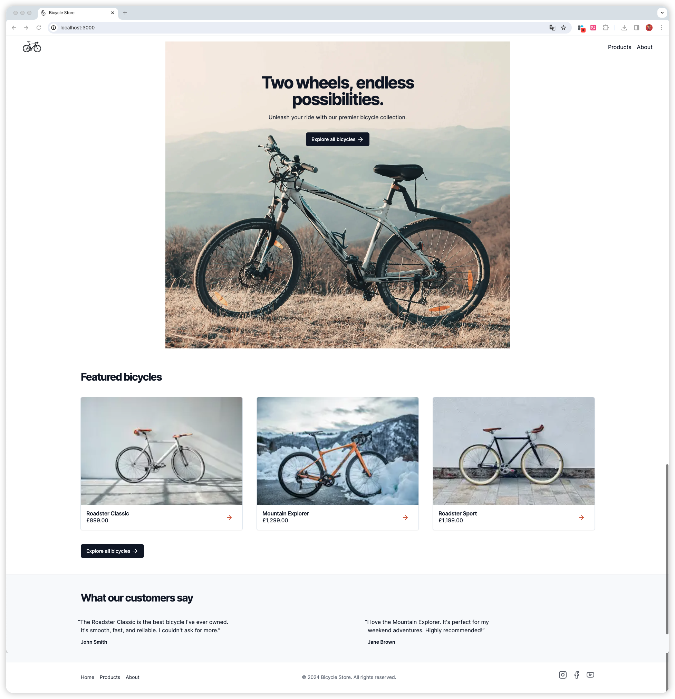

# Next.js 国际化 (i18n)：通过 next-intl 走向国际

虽然英语被认为是网络上的通用语言，但当您按[母语人士数量查看排名靠前的语言](https://www.babbel.com/en/magazine/the-10-most-spoken-languages-in-the-world)时，结果看起来相当多样化：

- 中文（13亿）
- 西班牙语（4.86亿）
- 英语（3.8亿）
- 阿拉伯语（3.62亿）
- 印地语（3.44亿）

语言是沟通的基础，很明显，如果你希望向国际友人提供你的 `Web` 内容，你可以通过支持多种语言来增强用户体验。国际化（通常缩写为i18n）还可以让您的企业在全球范围内扩张并进入新市场。

在本文中，我们将通过使用[next-intl](https://next-intl-docs.vercel.app/)实现国际化，这是一个专门为 `Next.js` 创建的库，它提供了国际化 Web 体验的所有相关部分。

# 目录

1. [1. 首先查看应用程序](#1-首先查看应用程序)
2. [2. 多语言或多区域](#2-多语言或多区域)

## 1. 首先查看应用程序

我们使用 `Next.js` 的 `App Router`实现了`主页`和`产品详情页面`;本文假定你已经具备[Next.js App Router](https://nextjs.org/docs/app)的基本知识。

让我们看一下当前的应用程序，以确定我们在国际化过程中需要解决的所有问题。

`主页`：此页面顶部有一个大的`Banner`部分，下面是产品推荐列表。

`产品详情页面`：此页面提供特定自行车的详细信息。

## 2. 多语言或多区域

在构建国际化网络体验时，我们通常会考虑两种范式：

- 多语言：这些网站提供多种语言的内容。
- 多区域：这些网站明确针对不同国家的用户。

虽然应用程序可能属于其中一类，但有些应用程序可以是多语言和多区域的。

就我们的应用程序而言，该公司位于英国，目前计划在瑞士销售其产品。瑞士的主要语言是德语，因此我们需要将内容本地化为这种语言。然而，瑞士没有一种，而是总共四种国家语言：德语、法语、意大利语，并且一小部分人口将罗曼什语作为第一语言。

此外，除了本地化文本内容之外，我们还需要适应该国的市场具体情况，例如支持新货币：瑞士法郎。

因此，我们的应用程序符合多语言和多区域的要求。

在浏览了现有的应用程序之后，我们可以确定作为国际化的一部分需要解决的以下方面：

标签：目前，所有应用程序标签都在应用程序中进行硬编码。我们需要将它们替换为根据当前语言而变化的动态标签。
后端数据：数据库中的产品信息需要提供英语和德语版本。此外，我们希望根据用户的语言显示推荐。
货币：我们应该支持在英国以英镑销售产品，在瑞士以瑞士法郎销售产品。
格式设置：数字、日期和时间格式设置应考虑用户的语言和区域。
国家/地区选择器：虽然我们可以根据请求标头猜测用户的国家/地区和语言偏好，但我们应该允许用户明确选择他们的偏好。
内容相当多，所以让我们开始吧！

## 标题 3

你的内容写在这里...

### 标题 3.1

你的内容写在这里...

### 标题 3.2

你的内容写在这里...
